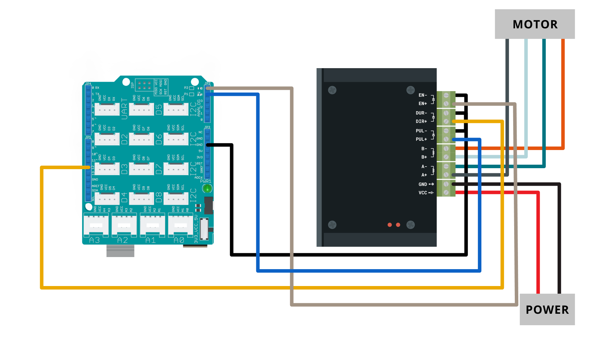
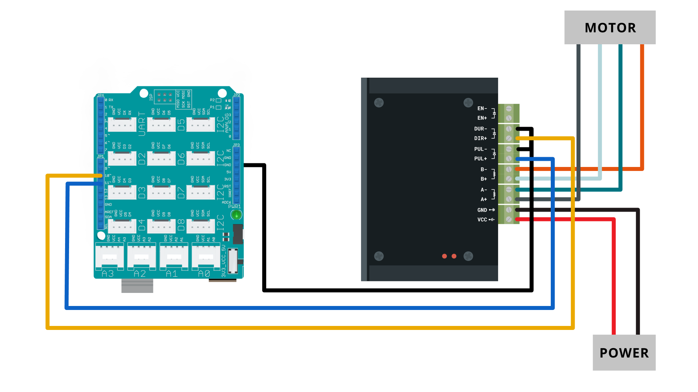
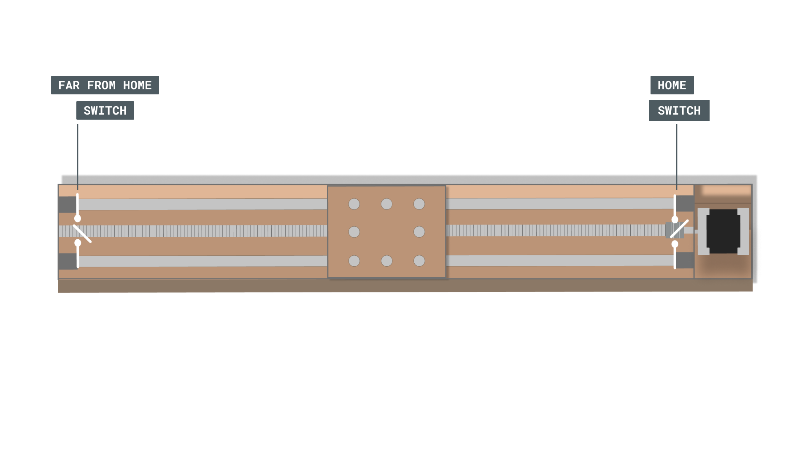

# Arduino EMBRYO 2 library

This library allows Arduino boards to control stepper motors to be used in the **EMBRYO 2** educational modular machine. The linear axis of this machine are controlled with the stepper motor, buttons and switches. This library has two classes:
- StepMotor class: allows us to control an individual linear axis.
- Embryo class: allows us to control two coupled linear axis.

**Attention**: For the library to work the endstops must be configure as pull-down, and the forward direction must rotate the step motor clockwise and backward direction must rotate the step motor anticlockwise.

To use this library:

```
#include <Arduino_Embryo_2.h>
```

## Circuit

- X-axis motor connections


- Y-axis motor connections


- Linear axis endstops


